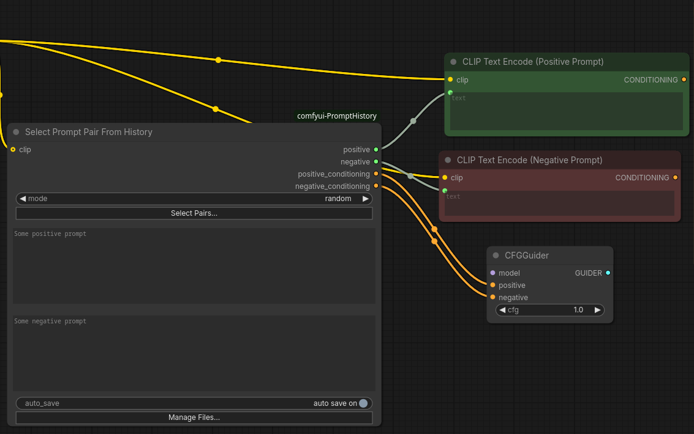
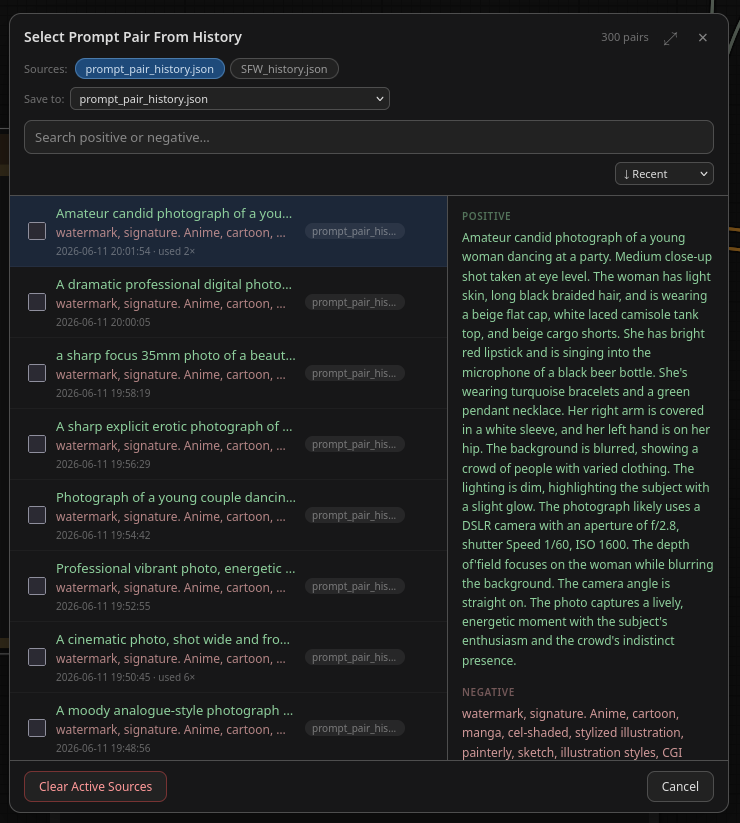

# comfyui-PromptHistory

Never lose a good prompt again. This extension adds two **Select Prompt From History** nodes that saves every prompt you use to plain JSON files — then lets you search, reuse, randomize, cycle, and batch-queue them straight from the node.

## Features

- **Persistent history** — prompts are saved to JSON files and survive restarts
- **Multiple history files** — manage separate collections (e.g. per-project or per-style)
- **Text search** — real-time search with case-sensitive, whole-word, and regex modes
- **Three operating modes** — edit a prompt manually, pick one randomly, or cycle sequentially
- **Deduplication** — identical prompts are merged; reusing one bumps its hit counter so favorites surface
- **Batch queue** — tick several prompts and queue them as separate runs in one click
- **Optional CLIP encoding** — connect a CLIP model and the node outputs conditioning directly, replacing a CLIP Text Encode node

 

## Installation

### ComfyUI Manager (recommended)

Search for **Prompt History** in the ComfyUI Manager custom node browser and install.

### Manual

```bash
cd ComfyUI/custom_nodes
git clone https://github.com/dawncreatescode/comfyui-PromptHistory
```

Restart ComfyUI. No extra Python packages are required.

## Quick start

1. Add the node: **Add Node → Prompt Tools → Select 'Prompt From History' or 'Prompt Pair From History'**
2. Wire it in one of two ways:

   **A — Drop-in replacement for CLIP Text Encode** (simplest):

   ```
   [Checkpoint Loader] ──clip──→ [Select Prompt (Pair) From History] ──conditioning──→ [KSampler positive/negative]
   ```

   **B — Text source for your existing setup:** leave `clip` unconnected and feed the `text` output into your CLIP Text Encode node (right-click it → convert its text widget to an input).

3. Type a prompt in the `text` widget and run the workflow. With `auto_save` on (the default), it's now in your history.
4. Next session, click **Select Prompts…** on the node, type a few words in the search box, and click the prompt to load it. Done.

## The three modes
| Mode | What happens each run |
|---|---|
| `edit` | Uses whatever is in the `text` widget — normal prompting; new prompts get saved to history |
| `random` | Picks a random prompt from your active history files — great for revisiting old ideas overnight |
| `sequential` | Steps to the next prompt in order — walk through an entire collection run by run |

For `random` and `sequential`, which files are drawn from is can be toggled in the history panel (see below).

## The history panel

Click **Select Prompts…** on the node to open it.

- **Search** filters as you type.
- **Click a prompt** to load it into the node's `text` widget.
- **Checkboxes + Queue N** queue each checked prompt as its own workflow run — an easy way to render a shortlist of candidates back-to-back.
- **Manage Files…** adds, removes, or discovers history files, and selects which file new prompts are saved to.

## Files and paths — which field does what

The node exposes three path-related fields. Only the first two are meant to be edited by hand:

| Field | Purpose |
|---|---|
| `history_paths` | Every history file the node knows about — one path per line |
| `save_to_path` | The single file that receives newly saved prompts |
| `active_paths` | Which files `random`/`sequential` draw from; set via the panel's checkboxes |

Paths can be absolute or relative to the ComfyUI root. The default file is created at:

```
ComfyUI/custom_nodes/comfyui-PromptHistory/history/prompt_history.json
```

## History file format

History is a plain JSON array — trivial to back up, sync between machines, hand-edit, or share:

```json
[
  {
    "key": "abc123def456abcd",
    "text": "a futuristic city at dusk, neon reflections, cinematic",
    "ts": "2026-03-12 14:05:00",
    "hits": 7
  }
]
```

`hits` counts how often a prompt has been reused. Duplicate prompts are never stored twice — saving an existing prompt just increments its counter. `max_entries` (default 500 000) caps file size.

> **Note:** prompts are stored as plain text on disk. Keep that in mind before committing history files to a public repo or sharing them.

## Node reference

**Category:** Prompt Tools

### Inputs

| Name | Type | Description |
|---|---|---|
| `mode` | dropdown | `edit` · `random` · `sequential` (see [modes](#the-three-modes)) |
| `text` | string | Prompt text (active in `edit` mode) |
| `clip` | CLIP | Optional — enables the conditioning output |
| `auto_save` | boolean | Save used prompts automatically (default: on) |
| `history_paths` | string | Newline-separated list of history file paths |
| `save_to_path` | string | File that receives new prompts |
| `active_paths` | JSON | Managed by the panel — files used for `random`/`sequential` |
| `max_entries` | integer | Max prompts per file (default: 500 000) |

### Outputs

| Name | Type | Description |
|---|---|---|
| `text` | STRING | Selected or edited prompt |
| `conditioning` | CONDITIONING | CLIP-encoded output (requires `clip` input) |

## FAQ

**Where is my history stored?** In the JSON file(s) you configure — by default inside this node's `history/` folder. They're just files: copy them to back up or move machines.

**Can I share a prompt library with someone?** Yes — send them the JSON file; they add its path via **Manage Files…**.

**I saved the same prompt twice — where did it go?** Duplicates are merged automatically; the existing entry's `hits` counter went up instead.

**Does updating ComfyUI or this node delete my history?** No — but since the default location is inside the node folder, prefer a path outside `custom_nodes/` if you reinstall from scratch often.

## License

MIT — see [LICENSE](LICENSE).
